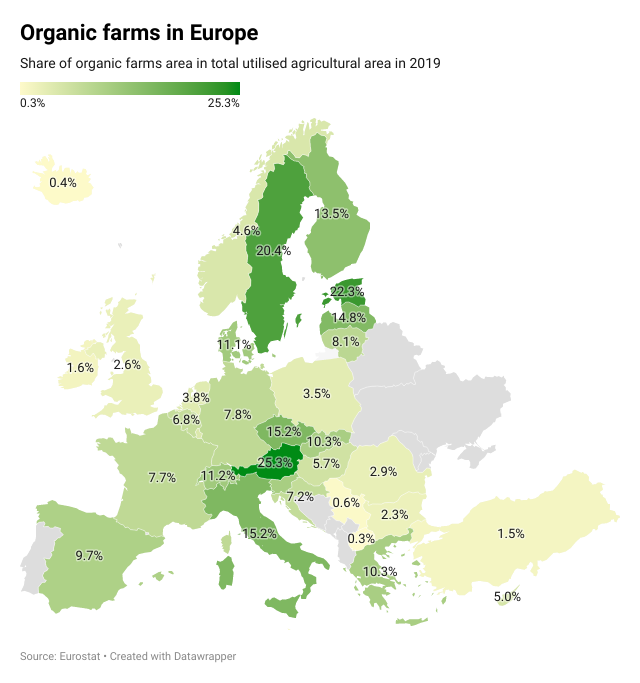

# Organic farms in Europe

Experimenting with Datawrapper using Eurostat's [data](https://ec.europa.eu/eurostat/statistics-explained/index.php?title=Organic_farming_statistics) on organic farming.

Jupyter notebooks to get the data from Eurostat and create this [choropleth map](https://www.datawrapper.de/_/kBxZS/) using [Datawrapper API](https://developer.datawrapper.de/docs/getting-started) directly in Python and then taking advantage of the [datawrapper](https://blog.datawrapper.de/datawrapper-python-package/) Python package.

Just to understand the API for future small projects.
